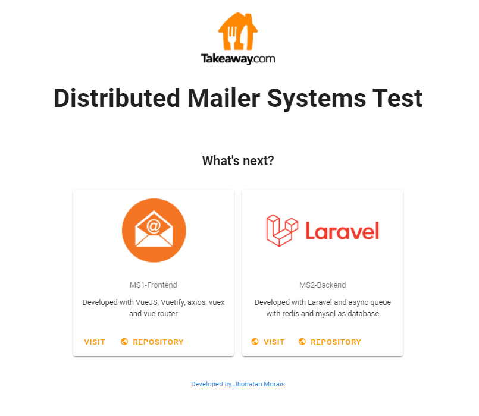

<h1 align="center">
    
</h1>

  <a href="#-technologies">Technologies</a>&nbsp;&nbsp;&nbsp;|&nbsp;&nbsp;&nbsp;
  <a href="#-project">Project</a>&nbsp;&nbsp;&nbsp;|&nbsp;&nbsp;&nbsp;
  <a href="#-livepreview">Live Preview</a>&nbsp;&nbsp;&nbsp;|&nbsp;&nbsp;&nbsp;
  <a href="#memo-licença">License</a>

 

  

## 🔖 Project

Mailer Distributed Systems was my takeaway code challenge. The followed requirement was needed:

### Backend

1. (done) Make sure emails are sent with a high degree of certainty. When such an external service is unavailable there should be a fallback to a secondary service.
2. (done) There probably will be more fallbacks so this should be taken into account. Do not use the Laravel mailer but write your own implementation.
3. (done) This microservice should be able to send an e-mail by an (JSON) API and through a CLI
   command.
4. (done) have a log entry for every email that is sent through this microservice.
5. (done) API calls the sending should happen asynchronously (use the queuing technique of your own preference).
6. (done) The micro-service is horizontal scalable
7. (partial) The code has tests
8. (done) You’re including a readme which describes the choices you made and why
9. (done) You’re using micro-commits
10. (done) we will only have Docker running on our machines and should not have to install any additional software to get this micro-service running.

### Backend (Bonus points)

11. (done) Create a VueJS application which allows us to send an email (using this service)
12. (done) which allows us to see all the emails with their status (e.g. queued, bounced,,delivered)
13. (done) Allow multiple mail formats
14. (not done) Allow more recipients

## 💻 Livepreview

Video Presentation with deploy instruction: [Visit Youtube Video](https://www.youtube.com/watch?v=IwsaY6F8S0E)
 

## 🚀 Technologies

### FrontEnd

-   Vue
-   Vuex
-   Vuetify
-   Vue Router
-   Axios

[Visit Frontend repo](https://github.com/getJv/mailer_microservices_ms1_frontend)

### Backend

-   Docker
-   Docker Compose
-   Laravel
-   Laravel Queue
-   Redis
-   HTTP API Mailer (Sendgrid)
-   HTTP API Mailer (MailJed)
-   Mysql

## :memo: Licença

Project under MIT license. Visit [LICENSE](LICENSE.md) to more.

<small>Fonte: la Unica 35 px - Photopea </small>
